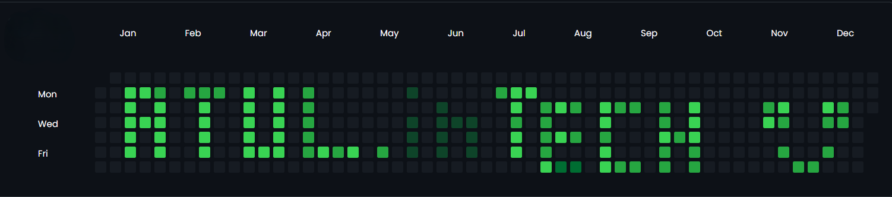

### Hi there 👋
               # ATUL_OLI -Portfolio

We are the coders.....We the builders....

<h2 align="left">I'm a College student... , from Uttarakhand ....</h2>

<h1 align="center"> Hi 👋, My name is ATUL OLI............😊 </h1>
................ &emsp;&emsp; &emsp;&emsp; &emsp;&emsp;.......................&emsp;&emsp; &emsp;&emsp; &emsp;&emsp;.......................&emsp;&emsp; &emsp;&emsp; &emsp;&emsp;.......................&emsp;&emsp; &emsp;&emsp; &emsp;&emsp;.......................&emsp;&emsp; &emsp;&emsp; &emsp;&emsp;

<h3 align="center">A passionate MERN Stack developer from India 🇮🇳 </h3>

  

  

- 🔭 I’m currently learning **Typescript & Nextjs**

- 🔭 I’m currently Looking for **Remote SDE Roles**

- 💬 Ask me about **MERN, JavaScript, C++, DSA**

- 📫 How to reach me **atuloli.27in.tech@gmail.com**

- 📄 Know about my experiences 

  

  

<b><u>Tech Explorer...  ....</u></b> Hi!🥂

|￣￣￣￣￣￣￣￣￣￣￣￣￣￣|

|   Developers Let's &nbsp; &nbsp; #Connect!&nbsp; |

|＿＿＿＿＿＿＿＿＿＿＿＿＿＿| 

&nbsp; &nbsp;&nbsp; &nbsp; &nbsp; &nbsp;&emsp;  \ (•◡•) / 

&nbsp; &nbsp;&nbsp; &nbsp; &nbsp; &emsp;&emsp; \ &nbsp;&nbsp; /   

&nbsp; &nbsp;&nbsp; &nbsp; &nbsp; &emsp; &ensp;  ——      

&nbsp; &nbsp;  &nbsp; &nbsp;&emsp; &emsp; | &emsp;  |    

&nbsp; &nbsp;&nbsp; &nbsp; &emsp;&emsp; |_&emsp;  |_    

Here are some ideas to get you started:

- 🔭 I’m currently working on ...&emsp;&emsp;&emsp;<b>MY skills</b>
- 🌱 I’m currently learning ... &emsp;&emsp;&emsp;<b><u>JavaScript</u></b>
- 👯 I’m looking to collaborate on ...&emsp;&emsp;&emsp;
- 🤔 I’m looking for help with ...&emsp;&emsp;&emsp;
- 💬 Ask me about ... &emsp;&emsp;&emsp;&emsp;TECH
- 📫 How to reach me: ...&emsp;&emsp;&emsp;&emsp;
- 😄 
- ⚡ Fun fact: ... Knowledge is impossible to take from ourself... 
-->

<h3 align="left">Support:</h3>

------>>>>   

<h3 align="left">Connect with me:</h3>

 
